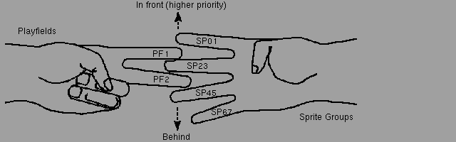

## Part 0 - architecture overview

Before we will dive into code, it's good to get to know the machine we are going to work with.

Of course, we would like to be comptaible with as many Amiga models as possible. *You* may have a maxed out A1200 with 060 CPU, lots of ram and a fancy graphics card, and sure, you can write something that will look nice on your machine, but that's not a setup majority of people have, so they wouldn't be able to experience your awesome production!

That's why we are going to target the most classic Amiga possible: the vanilla **A500** rocking **1.3 Kickstart** with **1MB of chip ram** (512K + 512K trapdoor expansion card).

This will give us possibilty to run our code on pretty much anything 
(sorry, Amiga 1000 ₍ᐢ.‸.ᐢ₎).

### OCS, ECS... AGA? What is that?
As you could deduce from the title, this series of posts is going to target the OCS Amiga. After reading a previous paragraph, you can probably
guess A500 is an OCS Amiga. But what does it exactly mean?

**OCS** stands for **Original Chip Set**. It's the original version of the Amiga chipset, that started its life with A1000, then (after some revisions) got implemented in A500 and A2000. 

It consists of a few important parts: **custom chips** and **fast/chip/"slow" RAM sections**. Diagram below represents the system architecture:

![[diagram.png]]

It's clearly divided into two main sections - the realm of the CPU and a custom chip section. Before we'll get to the chipset itself, it's important to explain how the RAM works. As you can see, there are three types of it, living in different parts of the system. What's the difference?
- **Fast RAM** - this is the memory that the custom chips can't use. Because of that, the CPU is free to access it at full speed at any given time (hence the name). It's optional, requiring an additional expansion memory card.
- **Chip RAM** - onboard Amiga memory. It's shared by both the CPU and the custom chips. Theoretically m68000 can access it during every other cycle, but in practice custom chips are proritized and can "steal" its cycles, as they deal with time-sensitive tasks like video refresh.
- **"Slow" RAM (also know as "pseudo fast" RAM)** - this one is a bit tricky. In A1000 the Agnus chip could address only 512K of RAM. In early revisions of A500 it was replaced with "Fat Agnus" which still supported only 512K of *chip* RAM, but also allowed to add another 512K of memory that is neither chip RAM nor a true fast RAM.  

Custom chips are the backbone of the Amiga system, taking most of the load off of the m68k CPU to manage audio, video and and I/O. 
Let's take a looks as some of the most useful features they provide, starting with the two coprocessors that live inside the Agnus chip.

## Copper

It's a simple, yet powerful tool that gives you almost a full control over the video system, via the feature called *Copper lists*. 
Copper list consists of a programmer-defined set of instructions that will be called once every frame, either during a *vertical blanking period* or when the beam hits a specific X,Y cooridnates on the screen. 
For example, it's very commonly used for various palette modifications, look at this screenshot from a game *"Shadow of the beast"*: 

[screenshot goes here]

Do you see the blue-pink gradient on the sky? In reality, the whole sky background is a solid color - but the Copper is programmed to change this one color every X lines mid-frame, which results in this nice, atmospheric sunset. 

So, how does it work?
At it's core, Copper's "instruction set" is very simple, there are only three of them: `MOVE`, `WAIT` and `SKIP`.  
- `MOVE` modifies the state of a given register. It can modify most of the Amiga special registers - for example `BPLXPTH` and `BPLXPTL` which are responsible setting up bitplanes.  
- `WAIT` tells Cooper to wait for until the video beam reaches the specific coordinates on the screen. While it's in a waiting state, it frees the bus. 
- In the ideal world all our code runs fast enough our Copper instructions can be executed at the exact beam positions we want. In reality, sometimes this is not the case - maybe some calculations took longer than expected, maybe BIillter hogged the bus, and by the time Copper got to instruction it was supposed to execute at the beginning of line 23, the beam already reached line 24. What now? By default, Copper will just execute this instruction anyway. Sometimes this is not a big problem, like in our sky gradient example above, world won't end if we change the color one line later. But oftentimes 

## Blitter

### How the image is made
As demosceners, we need to know exactly how Amiga generates the picture. It's a bit complex, but after getting into it, you'll realize it 
provides us a wide range of tools we can use to do some pretty sick stuff. So let's start with the basic stuff...

#### ...display modes 
On OCS, we have four "primary" modes:

- Low resolution, called *lores*. It supports 32 colors and for NTSC systems it's 320x200, for PAL - 320x256.
- High resolution, *hires* mode. Drops to only 16 colors, but weget 320x400 (NTSC) or 640x256 (PAL).
- Remaining two are *interlaced* version of the previous ones. As you can imagine, the number of colors and vertical resolution stays the same, but the horizontal resolution is doubled.

Simple, right? Well... there's more! There are also two special modes - *HAM (Hold and modify)* and *EHB (Extra Half Brite)*. They provide the ability to display more colors (4096 for HAM and 64 for EHB), but they come with their own quirks and constraints, which makes them not suitable
for every effects. We will re-visit them both in the future, since explaining how exactly HAM works deserves it's own post.

Most of our beginner-friendly effects will be using lores mode, until you'll get a good grasp of...

#### ...bitplanes and playfields
It will be easiest to explain on an example. Look:

![[dragon_full.png]]

Its resolution is 320x256 and it uses 16 colors, so a standard lores PAL full screen image. We are also going to use all five bitplanes. What are bitplanes? It's closely related to depth of the image we want to display. Imagine five monochrome layers, placed on top of each other to form the full, colored picture. How?

![[bitplanes.png]]

To determine the color of each pixel, Amiga fetches the value of this pixel on every bitplane and puts them together, to find the index of the color register that it's supposed to use. 
Example below shows a hypothetical bitmap, with the value of the first pixel for each bitplane marked as either `1` (black square) or `0` (white square). After putting them together we get `11010` (`0x1A`) which is the index of the color register that holds the final color of this particular pixel. In our example, the pixel will be light blue.

GIF below ilustrates how our picture will look if we reduce the number of displayed bitplanes:

Bitplanes are grouped into *playfields*. You can think of them as container. It's possible to display one or two playfields at the same time. The latter scenario is called the *Dual Playfield Mode*.
It creates two "layers" that can be manipulated separately. This mode is often used for games, where one playfield displays the actual game, while the second playfield, containing a statusbar/icons/menus is overlaid on top of it.
While using dual playfield, each of them can contain up to three bitplanes each - one playfield contains bitplanes 1, 3 and 5, while the other 2, 4 and 6. 
// TO DO - dodać notatkę o rozłożeniu kolorów między playfieldami

#### Sprites
Sprites are special entities, that live beyond bounds of playfields and bitplanes. There are 8 available sprites, grouped by two, which means they have some shared attributtes. 
Each sprite is 16px wide and can have unlimited height. They can have up to three colors (+ transparency), the palette is set per-group, which means sprites 0 and 1 will share the same three colors,
while sprites 2 and 3 will have their own set of colors and so on. 
Another thing that is specific for each sprite in a group is their display priority relative to playfields. The "Amiga Hardware Reference Manual" uses the hand analogy to illustrate how it works and I think
it's too cute not to share:

The order can be modified by using the <code>BPLCON2</code> register (which stands, of course, for _"bitplane control register 2"_, and yes, there is also <code>BPLCON1</code>).

The sprite groups support a mode called "attached", where instead of two sprites, the whole group functions as one sprite. The maximum size stays the same, but each pixel uses four bits to address its color register 
(instead of two bits used normally) which results in up to 15 possible colors (which are color registers used by sprites).

#### Scrolling
Each playfield can also be scrolled independently from each other, both vertically and horizontally. 

Vertical scrolling is fairly easy, it only requires setting the correct pointer that marks the point on the bitmap from which we want to start displaying it on the screen. Of course, our prepared bitmap
has to be "tall" enough, otherwise we will start displaying data from other parts of memory. 

You can also be smart and constantly rewrite the parts of the bitmap that are not currently visible on the screen to create a cyclical buffer that will give you an inifite space within the finite bitmap. If you have
any experience with demoscene on gamedev for old platforms (like NES), this is probably obvious.

To scroll the bitmap horizontally, more legwork is required. First, you need to know a few things:
- You can shift the display window left and right by 16 pixels
- Video hardware fetches data word-by-word at the beginning of each scanline
- You can tell it to start fetching the data early
Those three observations can already hint what do we need to do to achieve smooth scrolling.

// Vertical scrolling gif here

reee

